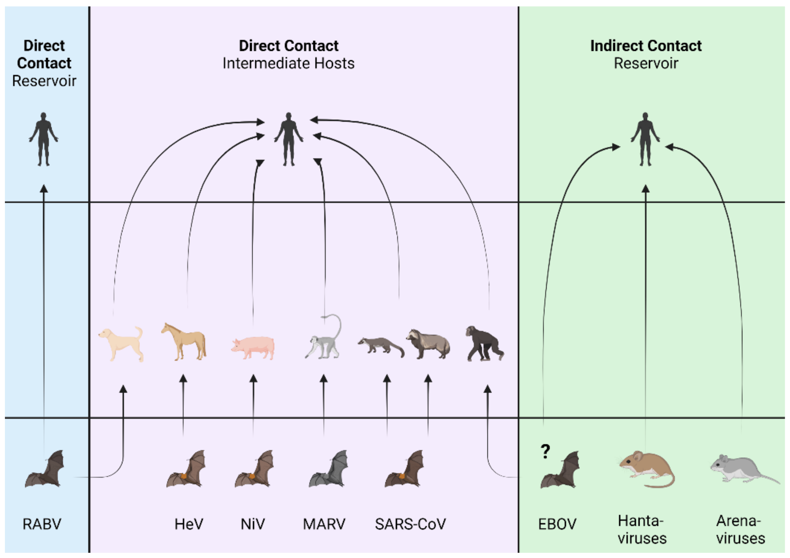
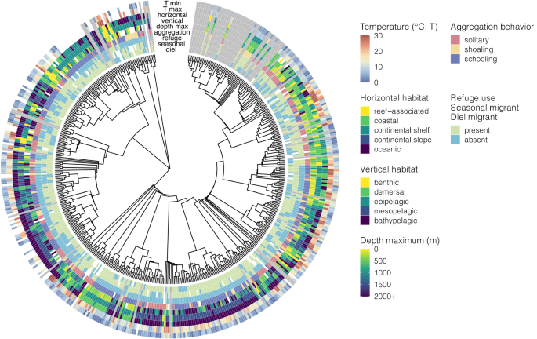
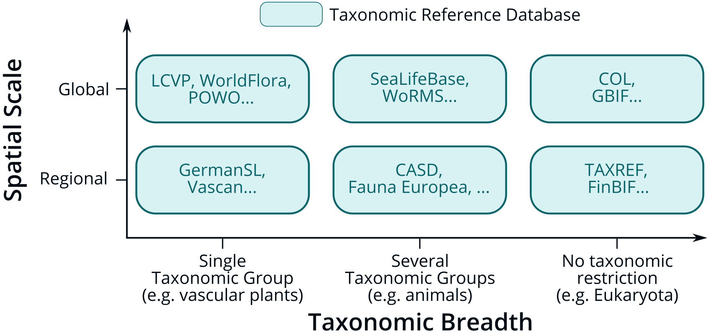
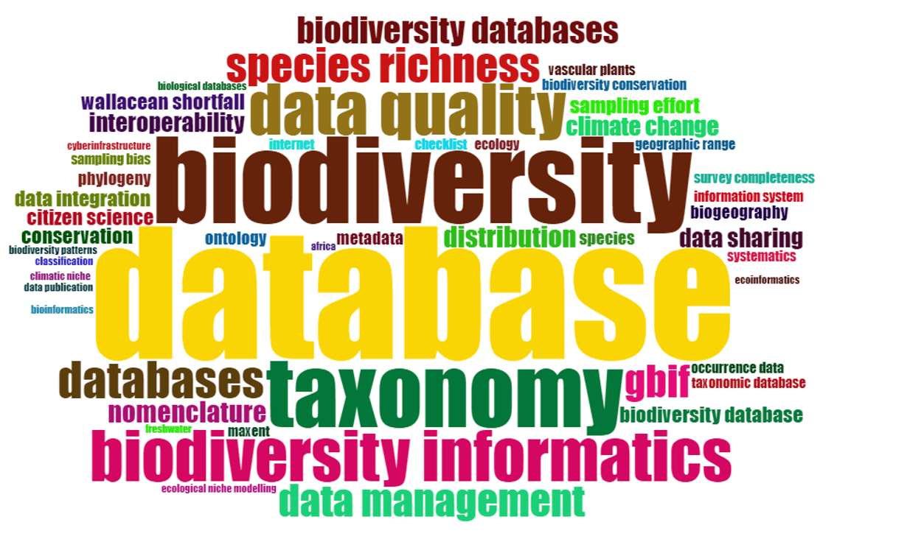
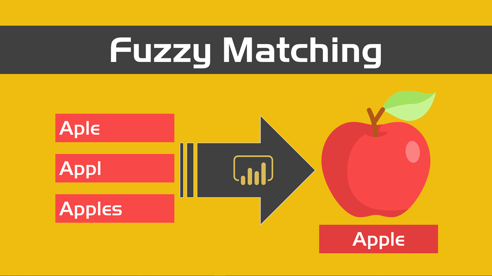

```{r setup, include=FALSE}
knitr::opts_chunk$set(echo = TRUE)
```

### Clase: Biodata

El cambio global de origen antropogénico ya no es una sorpresa para nadie. Sequías, extinciones masivas y la alteración de biomas completos debido a la actividad humana han provocado un grave deterioro de la biodiversidad a nivel global. El impacto humano en el planeta ha transformado profundamente el equilibrio de los ecosistemas. A medida que observamos este declive, la ciencia y la tecnología se han convertido en herramientas esenciales para monitorear estos cambios. En este contexto, surge la necesidad de bases de datos especializadas que recopilen y organicen información sobre la biodiversidad de nuestro planeta.


<center>{height=300px}</center>


Las bases de datos de biodiversidad nos permiten comprender y caracterizar un mundo en constante cambio. Enfermedades emergentes, dispersión de especies exóticas invasoras y el declive de especies en peligro de extinción son solo algunos de los procesos que podemos entender mejor gracias a la recolección, curatoría y análisis de datos. En un mundo cada vez más influenciado por la actividad humana, es crucial tomar decisiones basadas en estos datos.


<center>{height=300px}</center>


Las bases de datos taxonómicas constituyen un subtipo específico dentro de las bases de datos de biodiversidad. Sin embargo, existen otros tipos, como bases de datos de abundancia, presencia, ecológicas, genómicas y metagenómicas.

Es importante señalar que las bases de datos surgen principalmente de las necesidades de los investigadores. A menudo, estas bases combinan diferentes tipos de datos; por ejemplo, una base puede ser tanto ecológica como de abundancia, o bien combinar datos de presencia con información genómica.


<center>{height=300px}</center>


#### Bases de Datos Taxonómicas

Las bases de datos taxonómicas son sistemas de información diseñados para almacenar, organizar y facilitar el acceso a datos sobre la clasificación y nomenclatura de organismos vivos. Contienen información como nombres científicos, categorías taxonómicas, estado de conservación y datos de presencia. Debido a su origen curatorial, funcionan de manera autoritativa, sirviendo como estándar para científicos y autoridades gubernamentales en la elaboración de catálogos locales y la toma de decisiones en políticas ambientales.

Estas bases poseen una gran diversidad de dominios de información, lo que genera una notable heterogeneidad en los recursos y en los contenidos que ofrecen. Los dominios más comunes son los de escala geográfica y taxonómica. La **escala geográfica** se refiere al área que se busca caracterizar. Una base de datos puede centrarse en una localización específica (como un humedal), en un área comunal, nacional, regional (por ejemplo, Sudamérica) o global. Por otro lado, la **escala taxonómica** se refiere al nivel de clasificación que se desea investigar, como familias, órdenes, clases o phyla. Ejemplos de bases de datos de este tipo son **FishBase** o el **Catálogo de Plantas de la UdeC**. Además, existen una amplia variedad de bases de datos con diferentes objetivos y límites, dirigidas a distintos grupos taxonómicos en diversas áreas geográficas, proporcionando información relevante para investigadores de distintas disciplinas.

<center>{height=300px}</center>


Los datos presentes en una base de datos taxonómica generalmente se caracterizan por tres tipos de elementos: **etiquetas**, **categorías** y **cantidades**. Las etiquetas sirven para identificar elementos individuales, las categorías agrupan las etiquetas según criterios comunes, y las cantidades representan características medibles asociadas a cada etiqueta.

El dominio **nomenclatural** incluye el nombre propuesto de una especie, su taxonomía, información relevante y el formato utilizado en la base de datos, respetando los estándares taxonómicos y los criterios de diseño propios de bases de datos. En la práctica, la calidad y consistencia de la información taxonómica puede variar significativamente de un estándar a otro.

El dominio **de datos** abarca diferentes características o categorías asociadas a cada elemento dentro del dominio nomenclatural, como el **estatus taxonómico** (por ejemplo: aceptado, provisional, sinónimo, homónimo, etc.) y la **referencia bibliográfica** (autor, lugar y fecha de publicación).

El dominio **espacial** se refiere a la ubicación geográfica donde se registró el dato (por ejemplo, coordenadas, comuna, sector, región, país) y al contexto ambiental o de vegetación circundante en el que se observó.

Debido a que las bases de datos taxonómicas permiten una ordenación precisa de la biodiversidad, son especialmente útiles en la gestión de colecciones biológicas. Prácticamente todas las colecciones a nivel mundial están implementando esfuerzos para digitalizar y gestionar electrónicamente sus colecciones. Las bases de datos asociadas a estas colecciones suelen incluir datos curatoriales, tales como eventos de identificación (determinación de autor, fecha de determinación), préstamos, y su localización.

#### Datos sobre Especies

Los datos descriptivos de especies incluyen información como descripciones morfológicas, distribución geográfica, usos comunes, formas de vida, nombres vernáculos, hábitat, y pueden extenderse a otros campos como datos químicos, conductuales o ecológicos. Estos datos son fundamentales para entender mejor la biodiversidad en su totalidad.

<center>{height=300px}</center>


#### Complementación y Comparación de Bases de Datos

Dado el carácter autoritativo de las bases de datos, es crucial poder comparar diversas fuentes para mejorar la precisión de los estudios. La **complementación de datos** es una estrategia clave, ya que las bases de datos de biodiversidad suelen tener diferencias en cuanto a cobertura geográfica, taxonómica o temporal. Al combinar o comparar dos bases de datos, podemos llenar vacíos de información, creando una base más completa y robusta para investigaciones científicas y políticas de conservación.

La **verificación de calidad y consistencia** también es esencial. Comparar bases de datos permite identificar y corregir errores, inconsistencias o datos duplicados, lo cual es vital en el campo de la biodiversidad, donde las variaciones en el uso de nombres científicos y clasificaciones taxonómicas pueden afectar los análisis.

La **detección de especies nuevas o raras** es otro beneficio de la comparación de bases. Esta práctica puede llevar al descubrimiento de especies que solo aparecen en una base de datos, lo que podría señalar registros únicos que merecen una atención especial.

Finalmente, la **optimización de recursos para la conservación** también se ve favorecida por el cruce de bases de datos. Conociendo la distribución de registros de una especie en diferentes bases, es posible asignar los recursos de investigación y preservación de manera más eficiente, priorizando las áreas o especies que han sido menos documentadas.


## Código
Llamamos a las librerias
```{r libraries}
library(stringr)
library(stringdist)
library(dplyr)
```

## Código
cargamos los archivos
```{r carga de datos}
herbario_conc<-read.csv("conc_cactaceae.csv")
catalogo_col<-read.csv("col_cactaceae.csv")
head(herbario_conc)
head(catalogo_col)

colnames(herbario_conc)
colnames(catalogo_col)


####sacamos lo q no nos sirve 

group <- c('variety', 'species', 'form', 'subspecies', 'infraspecific name', 'subvariety', 'proles', 'subform', 'lusus', 'species aggregate')
catalogo_col<-catalogo_col[catalogo_col$taxonRank %in% group,]
```

#####Fuzzy Match

El fuzzy match se corresponde al conjunto de algoritmos que permiten reconocer 2 cadenas de texto diferentes como iguales, en base a un reconocimiento parcial de las mismas (ej. Lechuga vs. Lechwga). 
Estos algoritmos surgen de la aplicacion de la lógica difusa. La principal aplicacion de estos algoritmos está en las recomendaciones de google o el autocorrector del celular. 

A causa de las diferencias nonmenclanturales, (ej. Isoetes vs. Isoëtes), el mismo taxón puede tener dos nombres distintos pero cercanos en dos catalógos diferentes.O la calidad de los datos de un catalogo es significativamente superior a la otra, por lo cual una estrategia de fuzzymatch, permitiría comparar dos recursos con la misma informacion codificada de forma diferente


<center>{height=300px}</center>


## Código
El protagonista del trabajo.
```{r fuzzymatch}
length_conc<-nrow(herbario_conc)
length_col<-nrow(catalogo_col)
output<-data.frame()
for(i in length_conc){
  for(j in length_col){
    species_fuzzy <- grabl(
      pattern = toupper(trimws(catalogo_col[j,"scientificName"])), 
      x = toupper(trimws(herbario_conc[i,"Nombre.Cientifico.abreviado"])),
      method = "lv", maxDist = 0,4)
    if (species_fuzzy){
      new_row<-cbind.data.frame(catalogo_col[j,c("scientificName", "taxonID")],herbario_conc[i,c("Nombre.Cientifico.abreviado", "taxa_id")])
      output<-rbind.data.frame(output, new_row)
    }
  }
}


```


